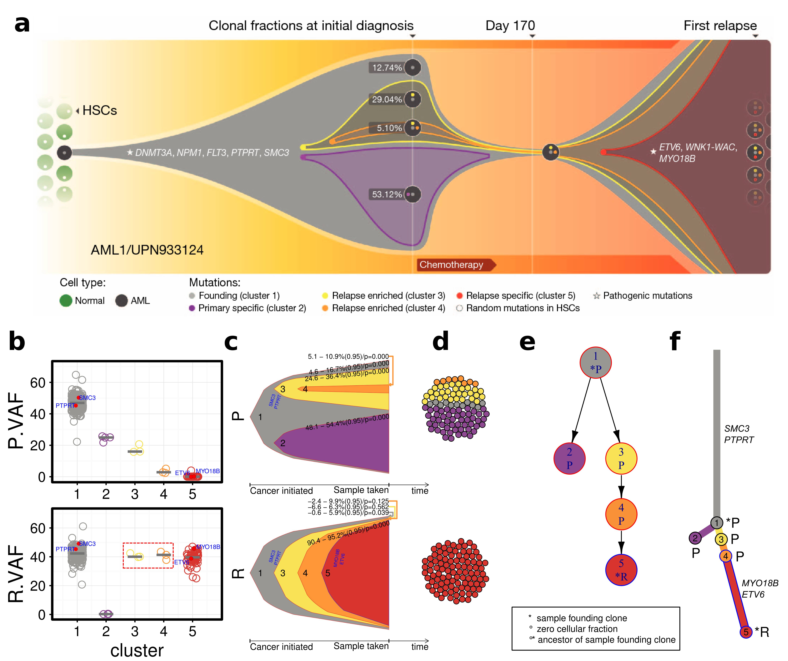
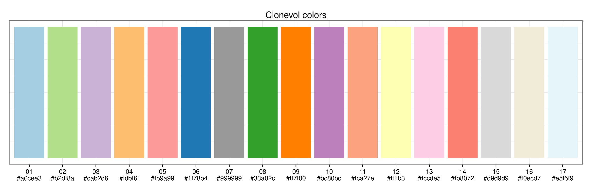

# ClonEvol
Inferring and visualizing clonal evolution in multi-sample cancer sequencing.

What's new?: Major overhaul of code and features, including sphere of cells, branch-based clonal evolution trees. Make sure you are running the latest version of ClonEvol in the following example.

Join <a href="https://groups.google.com/forum/#!forum/clonevol">clonEvol mailing list</a> for annoucements, feature requests, Q/A, etc.

The following figure demonstrates the reanalysis of a relapse acute myeloid leukemia case (AML1) published in Ding et al., Nature (2012). Top panel shows the original published fishplot, and the bottom panel shows the model inferred and visualized by ClonEvol.


*Fig. 1. ClonEvol reanalysis of AML1 (a) Original model, represented by a fishplot (b-f) Matching model predicted and visualized by ClonEvol.*

## Installation

### R requirements:
- R 2.15 or later

Recommended (tested) versions: 2.15, 3.0.2, 3.2.1, 3.2.3
It seems that R version 3.3 and later does not work well with branch-based tree plotting producing an error related to 'setNames' function. It is currently being investigated.

### Install ClonEvol and dependencies
```{r}
install.packages('devtools')
library(devtools)
install_github('hdng/clonevol')
install.packages('gridBase')
install.packages('gridExtra')
install.packages('ggplot2')
install.packages('igraph')
install.packages('packcircles')
install_github('hdng/trees')
```

## Run ClonEvol

ClonEvol performs clonal ordering and tree construction in multiple samples using the clusters of variants identified using other methods such as sciClone (https://github.com/genome/sciclone) or PyClone (http://compbio.bccrc.ca/software/pyclone/). ClonEvol has been extremely well tested and works very well with sciClone.

### Prepare input file
An input file typically has the following columns (* indicates mandatory):

1. cluster*: the cluster identity of the variant (make sure do not name cluster as “-1”. This value is reserved for ClonEvol internal use.)
2. sample1.VAF*: VAF of the variant in sample1
3. sample1.Depth: depth of the variant in sample1
4. sample2.VAF: VAF of the variant in sample2
5. sample2.Depth: depth of the variant in sample2
6. Additinal samples' VAF and depth columns
7. Additional variant annotation columns

Example input file:

| cluster  |  prim.vaf  |  met1.vaf  |  met2.vaf |
|----------|------------|------------|-----------|
| 1        |  51        |  44        |  52       |
| 1        |  45        |  56        |  47       |
| 1        |  55        |  50        |  49       |
| 2        |  31        |  47        |  0        |
| 2        |  28        |  38        |  0        |
| 2        |  31        |  45        |  0        |
| 2        |  30        |  47        |  0        |
| 2        |  31        |  53        |  0        |
| 2        |  38        |  48        |  0        |
...

### Run ClonEvol (infer and visualize clonal evolution)

You can read your variant clustering and annotation into a data frame (eg. using read.table). Here let's use AML1 data (Ding et al., 2012) included in ClonEvol. This patient has two samples sequenced (a primary and a relapse).

**Load and prepare AML1 data**
```{r}
library(clonevol)

data(aml1)
x <- aml1

# preparation: shorten vaf column names as they will be
# used as the sample names in all later visualizations
vaf.col.names <- grep('.vaf', colnames(x), value=T)
sample.names <- gsub('.vaf', '', vaf.col.names)
x[, sample.names] <- x[, vaf.col.names]
vaf.col.names <- sample.names
sample.groups <- c('P', 'R');
names(sample.groups) <- vaf.col.names
x <- x[order(x$cluster),]
```

**Set up the colors for subsequent visualizations**

ClonEvol has built-in colors designed to distinguish ~20 different clones, like this.


However, users can specify their own colors. To set up the colors for the clusters/clones that will used throughout the visualizations, create a vector of colors as follow. In this case, we chose colors matching the original figure in Ding et al.

```{r}
colors = c('#999793', '#8d4891', '#f8e356', '#fe9536', '#d7352e')
```
If you want ClonEvol to choose colors for you, simply set it to NULL, like this.

```{r}
colors = NULL
```

**Visualize the clustering (and clean-up as needed, before running ClonEvol)**

ClonEvol takes clustering of variants and perform clonal ordering to infer the trees. Although ClonEvol can tolerate errors in clustering, it is important to have the best clustering results possible to feed ClonEvol. The following code will plot the clustering results for you to investigate. ClonEvol calls this the "boxplot", as the very first version only plot the box plots, but it now can plot jitter, box, and violin plots to allow close investigation of the clustering (Fig. 1a). This plot is very powerful as it can visualize lots of samples and clusters at once.

```{r}
pdf('box.pdf', width=3, height=5, useDingbats=FALSE, title='')
pp <- variant.box.plot(x,
    cluster.col.name = 'cluster',
    show.cluster.size = FALSE,
    cluster.size.text.color = 'blue',
    vaf.col.names = vaf.col.names,
    vaf.limits = 70,
    sample.title.size = 20,
    violin = FALSE,
    box = FALSE,
    jitter = TRUE,
    jitter.shape = 1,
    jitter.color = colors,
    jitter.size = 3,
    jitter.alpha = 1,
    jitter.center.method = 'median',
    jitter.center.size = 1,
    jitter.center.color = 'darkgray',
    jitter.center.display.value = 'none',
    highlight = 'is.driver',
    highlight.note.col.name = 'gene',
    highlight.note.size = 2,
    highlight.shape = 16,
    order.by.total.vaf = FALSE
)
dev.off()
```

**Infer clonal evolution models**

At this step, we assume that you already thouroughly looked at your clustering and feel confident about it. Let's tell ClonEvol to perfrom clonal ordering and construct the consensus trees.

```{r}
y = infer.clonal.models(variants = x,
        cluster.col.name = 'cluster',
        vaf.col.names = vaf.col.names,
        sample.groups = sample.groups,
        subclonal.test = 'bootstrap',
        subclonal.test.model = 'non-parametric',
        num.boots = 1000,
        founding.cluster = '1',
        cluster.center = 'mean',
        clone.colors = colors,
        min.cluster.vaf = 0.01,
        sum.p = 0.05,
        alpha = 0.05)
```

**Mapping driver events onto the trees**

If the previous step succeeds and gives you a tree or several trees (congrats!), we can next map some driver events onto the tree to make sure they will be visualized later.

```{r}
y <- transfer.events.to.consensus.trees(y,
    x[x$is.driver,],
    cluster.col.name = 'cluster',
    event.col.name = 'gene')
```

**Convert node-based trees to branch-based trees**

ClonEvol can plot both node-based tree (each clone is a node), or branch-based tree (each branch represents the evolution of a clone from its parental clone, and each node represents a point where the clone is established/founded. Before we can draw the latter tree, we need to prepare it.

```{r} 
y <- convert.consensus.tree.clone.to.branch(y, branch.scale = 'sqrt')
```

**Plot clonal evolution models**

Now it is exciting time, visualzing the clonal evolution models. Let's run the following command and reproduce Fig. 1 above. Output plot should look like the whole bottom panels (b-f) in Fig. 1.

```{r}
plot.clonal.models(y,
    # box plot parameters
    box.plot = TRUE,
    fancy.boxplot = TRUE,                  
    fancy.variant.boxplot.highlight = 'is.driver',
    fancy.variant.boxplot.highlight.shape = 21,
    fancy.variant.boxplot.highlight.fill.color = 'red',
    fancy.variant.boxplot.highlight.color = 'black',
    fancy.variant.boxplot.highlight.note.col.name = 'gene',
    fancy.variant.boxplot.highlight.note.color = 'blue',
    fancy.variant.boxplot.highlight.note.size = 2,
    fancy.variant.boxplot.jitter.alpha = 1,
    fancy.variant.boxplot.jitter.center.color = 'grey50',
    fancy.variant.boxplot.base_size = 12,
    fancy.variant.boxplot.plot.margin = 1,
    fancy.variant.boxplot.vaf.suffix = '.VAF',
    # bell plot parameters
    clone.shape = 'bell',
    bell.event = TRUE,
    bell.event.label.color = 'blue',
    bell.event.label.angle = 60,    
    clone.time.step.scale = 1,
    bell.curve.step = 2,
    # node-based consensus tree parameters
    merged.tree.plot = TRUE,
    tree.node.label.split.character = NULL,                   
    tree.node.shape = 'circle',
    tree.node.size = 30,
    tree.node.text.size = 0.5,
    merged.tree.node.size.scale = 1.25,
    merged.tree.node.text.size.scale = 2.5,
    merged.tree.cell.frac.ci = FALSE,
    # branch-based consensus tree parameters
    merged.tree.clone.as.branch = TRUE,
    mtcab.event.sep.char = ',',
    mtcab.branch.text.size = 1,
    mtcab.branch.width = 0.75,
    mtcab.node.size = 3,
    mtcab.node.label.size = 1,
    mtcab.node.text.size = 1.5,
    # cellular population parameters    
    cell.plot = TRUE,
    num.cells = 100,
    cell.border.size = 0.25,
    cell.border.color = 'black',
    clone.grouping = 'horizontal',
    #meta-parameters
    scale.monoclonal.cell.frac = TRUE,
    show.score = FALSE,    
    cell.frac.ci = TRUE,
    disable.cell.frac = FALSE,    
    # output figure parameters
    out.dir = 'output',
    out.format = 'pdf',
    overwrite.output = TRUE,
    width = 8, height = 4,
    # vector of width scales for each panel from left to right
    panel.widths = c(3,4,1,3,1),
)

```

If you want to plot only the trees, run this:

```{r}
pdf('output/trees.pdf', width=3, height=5, useDingbats=F)
plot.all.trees.clone.as.branch(y, branch.width=0.5, node.size=1, node.label.size=0.5)
dev.off()
```

**Plot pairwise VAFs or CCFs across samples**

If you need to inspect pair of samples, the following command is useful for pairwise plot of VAF or CCF.
```{r}
plot.pairwise(x, col.names = vaf.col.names,
                  out.prefix = 'variants.pairwise.plot',
                  colors = colors)
```

**Plot mean/median of clusters across samples (cluster flow)**

```{r}
plot.cluster.flow(x, vaf.col.names = vaf.col.names,
                      sample.names = c('Primary', 'Relapse'),
                      out.file = 'flow.pdf',
                      colors = colors)

```

### Visualize trees predicted by other tools

In order to visualize trees predicted by other tools, we need to prepare two files:
1. variants.tsv file: similar to ClonEvol input, with clusters assigned by other tools
2. tree.tsv: predicted tree, consisting of:
- at least 3 columns: clone, parent, sample.with.nonzero.cell.frac.ci
- additional columns are: colors, events

Fist, read the tree and variant list from files:

```{r}
y = import.tree('tree.tsv', 'variants.tsv')
```

Then, you can prepare annotated branch-based tree with branch length scaled to the number of clonal marker variants of the clones
```{r}
y = convert.consensus.tree.clone.to.branch(y, branch.scale='sqrt')
```

You can then also map driver events onto the tree (if the variant file you prepared has 'cluster', 'is.driver', and 'gene' column):

```{r}
y <- transfer.events.to.consensus.trees(y,
    y$variants[y$variants$is.driver,],
    cluster.col.name = 'cluster',
    event.col.name = 'gene')
```

Now plot the tree with this:

```{r}
pdf('imported-tree.pdf', width=3, height=5, useDingbats=F)
plot.all.trees.clone.as.branch(y, branch.width=0.5, node.size=1, node.label.size=0.5)
dev.off()
```

## Known issues

Bell plots sometimes do not position nicely in plot.clonal.models function (eg. when there is a clone of extremely low cellular fraction together with complex clonal structure). Setting bell.curve.step=x where x is a small value (eg. x=0) or clone.shape='polygon' in plot.clonal.models function will fix it.

If you encounter this error: "Error: evaluation nested too deeply: infinite recursion / options(expressions=)?", increase recursive stack size by:

```{r}
options(expressions=100000)
```
## Versions of dependency packages that were used to make the AML1 example

ClonEvol depends on several packages, including ggplot2 and igraph. Sometimes backward compatibility is hard to maintained in newer version of packages. ClonEvol itself has changed a lot since its intitial version as well and some old code might not work well. If a strange error occurs, check if you have similar versions of the packages, and if you can, please email me with some reproducible code and data.

```{r}
 R version 3.2.2 (2015-08-14)
 Platform: x86_64-pc-linux-gnu (64-bit)
 Running under: Ubuntu precise (12.04.5 LTS)

 attached base packages:
 [1] grid      stats     graphics  grDevices utils     datasets  methods  
 [8] base     

 other attached packages:
 [1] trees_0.1.3.9000  igraph_1.0.1      packcircles_0.2.0 gridBase_0.4-7   
 [5] gridExtra_0.9.1   ggplot2_2.2.1     clonevol_1.0     

 loaded via a namespace (and not attached):
 [1] Rcpp_0.12.10     plyr_1.8.4       gtable_0.1.2     magrittr_1.5    
 [5] scales_0.4.1     rlang_0.1        lazyeval_0.2.0   labeling_0.2    
 [9] tools_3.2.2      munsell_0.4.2    colorspace_1.2-4 tibble_1.3.1    
```

## How to cite ClonEvol

Ha X. Dang, Brian S. White, Steven M. Foltz, Christopher A. Miller, Jingqin Luo, Ryan C. Fields, Christopher A. Maher. ClonEvol: clonal ordering and visualization in cancer sequencing (under review)

Ha X. Dang, Julie G. Grossman, Brian S. White, Steven M. Foltz, Christopher A. Miller, Jingqin Luo, Timothy J. Ley, Richard K. Wilson, Elaine R. Mardis, Ryan C. Fields, Christopher A. Maher. Clonal evolution inference and visualization in metastatic colorectal cancer. Late Breaking Research Track. Intelligent Systems for Molecular Biology (ISMB) 2016. Orlando, Florida, USA. Jul. 2016.

## Contact
Ha X. Dang @ haxdang (at) gmail (dot) com
