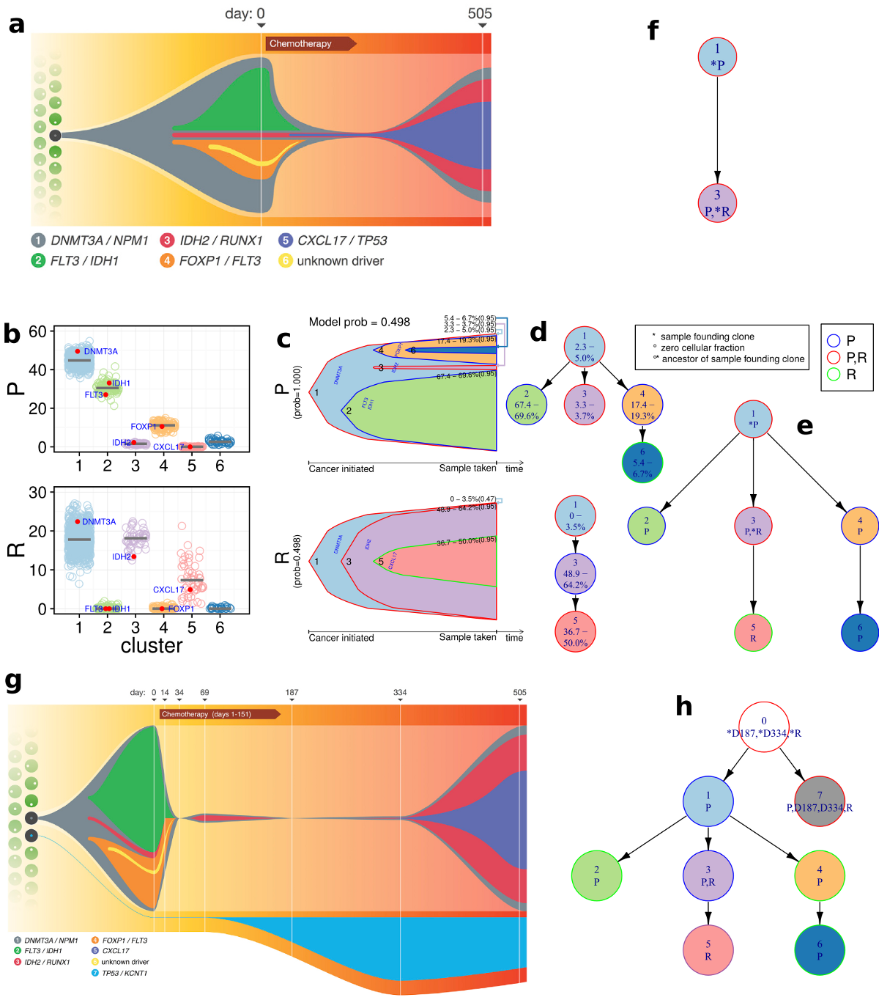
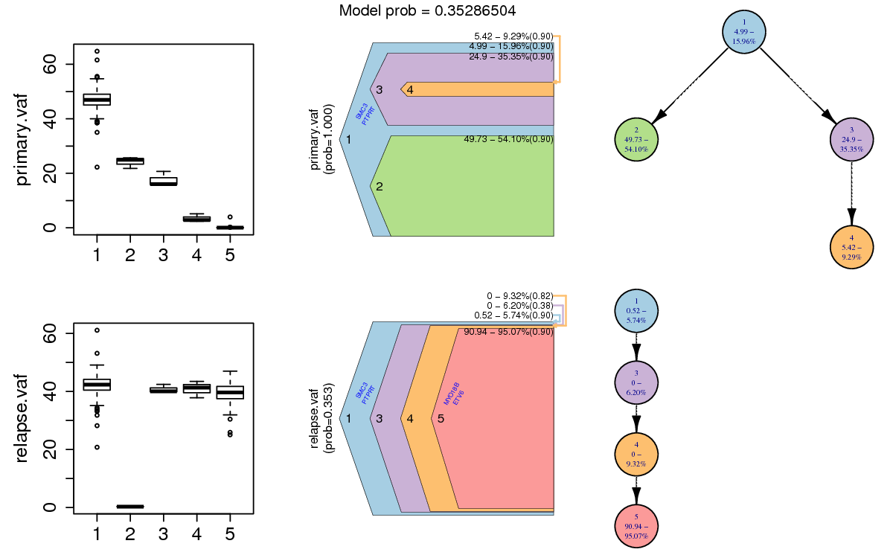
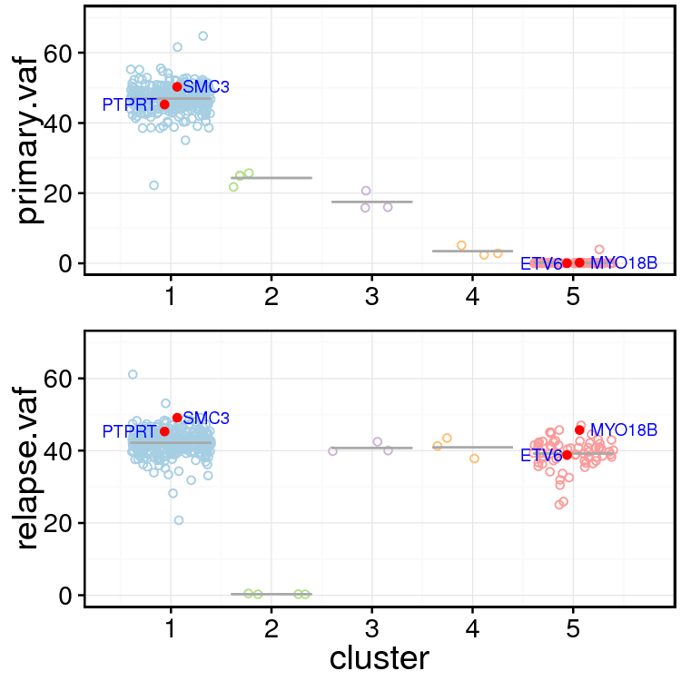

# ClonEvol
Inferring and visualizing clonal evolution in multi-sample cancer sequencing.

ClonEvol is currently under some major improvement to allow simulatenous analysis and intuitive visualization of a great number of samples across many types of tissues/organs. Join <a href="https://groups.google.com/forum/#!forum/clonevol">clonEvol mailing list</a> for annoucements, feature requests, Q/A, etc. The following figure is a bit old compared to what clonEvol can do now, but should give a general idea. Technical documentation is under construction.



##Installation

###Requirements:
- R 3.0.2 or later

###Install ClonEvol
```{r}
install.packages("devtools")
library(devtools)
install_github("clonevol", "hdng") or install_github("hdng/clonevol") if the former does not work
```

###Install dependencies

```{r}
install.packages("ggplot2")
install.packages("igraph")
```

##Run ClonEvol

ClonEvol infers clonal evolution models in single sample or multiple samples using the clusters of variants identified previously using other methods such as sciClone or PyClone. Variant clusters must be biologically interpretable for ClonEvol to be able to infer some models. Most of the time you will find yourself iteratively refining the clustering of the variants and running ClonEvol, until some reasonable models are found.

###Prepare input file
An input file typically has the following columns (* indicates mandatory):

1. cluster*: the cluster identity of the variant (make sure do not name cluster as “-1”. This value is reserved for ClonEvol internal use.)
2. sample1.VAF*: VAF of the variant in sample1
3. sample1.Depth: depth of the variant in sample1
4. sample2.VAF: VAF of the variant in sample2
5. sample2.Depth: depth of the variant in sample2
6. Additinal samples' VAF and depth columns
7. Additional variant annotation columns

Example input file:

| cluster  |  prim.vaf  |  met1.vaf  |  met2.vaf |
|----------|------------|------------|-----------|
| 1        |  51        |  44        |  52       |
| 1        |  45        |  56        |  47       |
| 1        |  55        |  50        |  49       |
| 2        |  31        |  47        |  0        |
| 2        |  28        |  38        |  0        |
| 2        |  31        |  45        |  0        |
| 2        |  30        |  47        |  0        |
| 2        |  31        |  53        |  0        |
| 2        |  38        |  48        |  0        |
...

###Run ClonEvol

You can read your data into a data frame (eg. using read.table). Here let's use AML1 data (Ding et al., 2012) included in ClonEvol.

**Load AML1 data**
```{r}
library(clonevol)
data(aml1)
vaf.col.names <- grep(".vaf", colnames(aml1), value=TRUE)
```

**Infer clonal evolution models**
```{r}
x <- infer.clonal.models(variants=aml1,
            cluster.col.name="cluster",
            vaf.col.names=vaf.col.names,
            subclonal.test="bootstrap",
            subclonal.test.model="non-parametric",
            cluster.center="mean",
            num.boots=1000,
            founding.cluster=1,
            min.cluster.vaf=0.01,
            p.value.cutoff=0.01,
            alpha=0.1,
            random.seed=63108)
```

**Plot clonal evolution models**
```{r}
plot.clonal.models(x$models,
                   matched=x$matched,
                   variants=aml1,
                   clone.shape="bell",
                   box.plot=TRUE,
                   out.format="pdf",
                   overwrite.output=TRUE,
                   scale.monoclonal.cell.frac=TRUE,
                   cell.frac.ci=TRUE,
                   tree.node.shape="circle",
                   tree.node.size=40,
                   tree.node.text.size=0.65,
                   width=11, height=5,
                   out.dir="output")
```
**Plot clonal evolution models (with variant highlight in bell plots)**
```{r}
var.to.highlight = aml1[aml1$is.cancer.gene, c("cluster", "gene")]
colnames(var.to.highlight) = c("cluster", "variant.name")
plot.clonal.models(x$models,
                   matched=x$matched,
                   variants=aml1,
                   box.plot=TRUE,
                   out.format="pdf",
                   overwrite.output=TRUE,
                   scale.monoclonal.cell.frac=TRUE,
                   cell.frac.ci=TRUE,
                   variants.to.highlight=var.to.highlight,
                   variant.color="blue",
                   variant.angle=60,
                   tree.node.shape="circle",
                   tree.node.size=40,
                   tree.node.text.size=0.65,
                   width=8, height=5,
                   out.dir="output")
```

Output should look like this:




**Plot box/violin/jitter of VAFs with cancer gene variants highlighted**
```{r}
num.clusters <- length(unique(aml1$cluster))
pdf("variants.jitter.pdf", width=5, height=5, useDingbats=FALSE)
pp = variant.box.plot(aml1,
                 vaf.col.names=vaf.col.names,
                 variant.class.col.name=NULL,
                 cluster.axis.name="",
                 vaf.limits=70,
                 violin=FALSE,
                 box=FALSE,
                 order.by.total.vaf=FALSE,
                 jitter=TRUE,
                 jitter.center.method="mean",
                 jitter.center.size=0.5,
                 jitter.center.color="darkgray",
                 jitter.shape=1,
                 jitter.color=get.clonevol.colors(num.clusters),
                 jitter.size=2,
                 jitter.alpha=1,
                 highlight="is.cancer.gene",
                 highlight.note.col.name="gene",
                 highlight.shape=19,
                 display.plot=TRUE)
dev.off()
```

Output figure should look like this:




**Plot pairwise VAFs across samples**
```{r}
plot.pairwise(aml1, col.names=vaf.col.names,
                  out.prefix="variants.pairwise.plot",
                  colors=get.clonevol.colors(num.clusters))
```

**Plot mean/median of clusters across samples (cluster flow)**
```{r}
plot.cluster.flow(aml1, vaf.col.names=vaf.col.names,
                      sample.names=c("Primary", "Relapse"),
                      out.file="flow.pdf",
                      colors=get.clonevol.colors(num.clusters))

```

##Known issues
Bell plots sometimes do not position nicely in plot.clonal.models function (eg. when there is a clone of extremely low cellular fraction together with complex clonal structure). Setting bell.curve.step=x where x is a small value (eg. x=0) or clone.shape="polygon" in plot.clonal.models function will fix it.

If you encounter this error: "Error: evaluation nested too deeply: infinite recursion / options(expressions=)?", increase recursive stack size by:

```{r}
options(expressions=10000)
```

##How to cite clonEvol

Ha X. Dang, Brian S. White, Steven M. Foltz, Christopher A. Miller, Jingqin Luo, Ryan C. Fields, Christopher A. Maher. ClonEvol: inferring and visualizing clonal evolution in multi-sample cancer sequencing (under review)

Ha X. Dang, Julie G. Grossman, Brian S. White, Steven M. Foltz, Christopher A. Miller, Jingqin Luo, Timothy J. Ley, Richard K. Wilson, Elaine R. Mardis, Ryan C. Fields, Christopher A. Maher. Clonal evolution inference and visualization in metastatic colorectal cancer. Late Breaking Research Track. Intelligent Systems for Molecular Biology (ISMB) 2016. Orlando, Florida, USA. Jul. 2016.

##Contact
Ha X. Dang @ haxdang (at) gmail (dot) com
