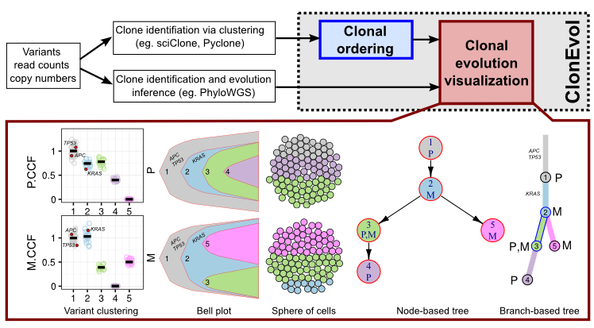
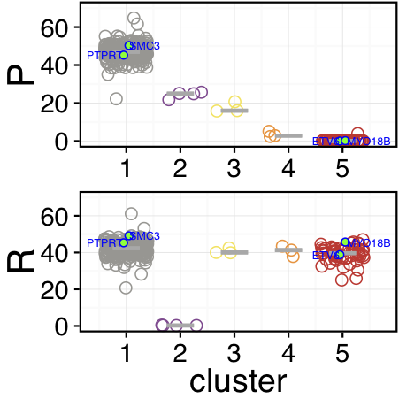
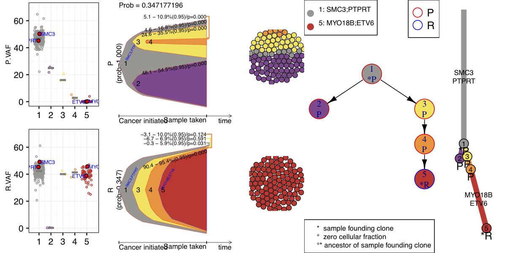

<!-- \newpage 
\tableofcontents
\newpage
-->

\newpage

# What is ClonEvol?

ClonEvol is a package for clonal ordering and clonal evolution visualization. It uses the clustering of heterozygous variants identified using other tools as input to infer consensus clonal evolution trees and estimate the cancer cell fraction (also called clonal frequency) of the clones in individual samples. ClonEvol can deal with statistical uncertainty and error in sequencing and data analysis that may distort the cellular prevalence estimate of individual variants.



ClonEvol uses a bootstrap resampling approach to estimate the cancer cell fraction ($CCF$) of the clones (ie. clonal frequency), given the $CCF$ of the variants and their clusters, via the following equation (referred to as the sum rule).

$$CCF(clone\ Y) = CCF(cluster\ Y) - \sum_{X_i \in all\ direct\ subclones\ of Y}{CCF(cluster\ X_i)}$$

This results in a bootstrap estimate of the sampling distribution of the $CCF$ of clone $Y$ (given its direct subclones ${X_i}$) that can be subsequently used to estimate: (i) the confidence interval for the $CCF$ of clone $Y$; and (ii) the probability that the $CCF$ of clone $Y$ is negative (or non-negative).

A negative $CCF$ estimate for a clone $Y$ indicates that the sum rule is violated by the ordering that all clones {$X_i$} are arisen directly from clone $Y$ in a clonal evolution model. A negative $CCF$ estimate could also be resulted from the statistical uncertainty and errors (mentioned above) present in the cellular prevalence and clustering of variants as input to ClonEvol. Hence, the sum rule is only considered violated in ClonEvol if the confidence interval of the $CCF$ of a clone is heavily shifted toward negative value, meaning the probability of negative $CCF$ is high (or the probability that the $CCF$ is non-negative is low).

ClonEvol evaluates the clonal ordering for all parental clones in all potential trees. A tree is reported if none of its clone violates the sum rule as described above.

ClonEvol can produce multiple visualizations (Figure \ref{clonevol_overview}), including:

1. Bell plots to present clonal dynamics over time (building upon the Fishplot [@ding_clonal_2012])
2. Sphere of cells to present clonal subpopulations of a sample
3. Annotated node-based and branch-based trees to present clonal relationships and seeding patterns between samples.

ClonEvol is maintained at https://github.com/hdng/clonevol.

# Installation

**R requirements**

ClonEvol requires R 2.15 or later. It has been tested with R versions: 2.15, 3.0.2, 3.2.1, 3.2.3, 3.3.3, 3.4.0 on MacOS and Linux.

**Install from Github**

```{r eval=FALSE}
install.packages('devtools')
library(devtools)
install_github('hdng/clonevol')
install.packages('gridBase')
install.packages('gridExtra')
install.packages('ggplot2')
install.packages('igraph')
install.packages('packcircles')
```

**Install from Bioconductor**

Currently unavailable

# Clonal evolution analysis workflow 

A typical analysis workflow for clonal evolution inference using sequencing data involves the following steps:

1. Preparing a comprehensive and reliable set of somatic mutations
2. Clustering the mutations based on cellular prevalence
3. Evaluating the clustering results
4. Inferring clonal evolution trees (ie. clonal ordering)
5. Visualizing data and clonal evolution trees
6. Interpreting the results

ClonEvol provides tools for steps 3-6 (see Figure \ref{clonevol_overview}). Steps 1-2 should be done prior to running ClonEvol, using other tools (briefly described below).

# Step 1: Preparing variants for clonal evolution inference

The depth of sequencing, the quantity and quality of samples, and the quantity and quality of somatic variants can have a profound impact on the resulting clonal evolution models. In an ideal situation, we want:

1. Large number of samples
2. Large number of variants (exome sequencing is okay, but whole genome sequencing provides much better coverage of passenger somatic mutations)
3. Multiple time points
4. Multi-region samples (due to intra-tumor heterogeneity)
5. Deep sequencing, eg. targeted validation

This does not mean that we cannot study clonal evolution in cancer without such an ideal dataset. However, be prepared that in highly heterogeneous patients/tumors, your data may yield models that underestimate the true model.

# Step 2: Clustering variants

Clustering the variants based on their cellular prevalence across samples is a critical step. The purpose of clustering variants is to identify the clones. Due to tumor heterogeneity, the cellular prevalence of distinct clones may be present at different frequencies between samples (eg. sample A has 90% clone X and 10% clone Y while sample B has 50% clone X, 50% clone Y). Therefore, the clonal marker variants of a clone will show similar cellular prevalence across samples and will likely be clustered together. The end product of a variant clustering tool is the clusters, each of them consists of the clonal marker variants of a distinct clone.

Cellular prevalence of variants used in the clustering algorithm is often measured by the variant allele frequency ($VAF$), calculated as the ratio of the number of reads carrying the variant and the total number of reads at the site. The assumption for the clustering algorithm to work is that $VAF$ provides a good estimate of the cellular fraction of a variant, ie. the fraction of cells carrying the variant. In the case with diploid heterozygous variants (copy number neutral), the cancer cell fraction ($CCF$) of a variant can be calculated as twice of its $VAF$. However, copy number variation is common in cancers, further deviating their $VAF$, and hence $CCF$, from actual cellular prevalence if left uncorrected. Both diploid heterozygous and copy-altered variants can be used to feed the clustering algorithms. If only diploid heterozygous variants are used, clustering can be performed using sciClone [@miller_sciclone:_2014] and $VAF$ can be used in ClonEvol. If copy-altered variants are used, clustering should be performed by copy number aware tools such as Pyclone [@roth_pyclone:_2014]. In the latter case, copy number corrected cellular prevalence estimate provided by the clustering tool is prefered to be used in ClonEvol, especially when there is bias between gain and loss events.

# Step 3: Evaluating the variant clustering results

Since each cluster represents a clone, missing or incorrectly infer a cluster could hinder us from successful construction of the evolution models. Therefore, it is extremely important to obtain a good clustering result. ClonEvol provides a convenient visualization of variant clusters across multiple samples to help evaluate clustering results, particularly when no tree is inferred.

Assume that we already have a clustering result consisting of the cluster identity and the cellular prevalence estimate for individual variants. This can be stored as a tabular text file and read into a data frame using `read.table` function. Here we use data of a relapsed myeloid leukemia case (AML1) [@ding_clonal_2012] available with ClonEvol. This is a simple case with two samples (a primary and a relapse) sequenced using whole genome and deep targeted validation.

## Loading ClonEvol and AML1 clustering data

```{r eval=FALSE}
library(clonevol)
data(aml1)
x <- aml1$variants
```

## Preparing clustering data

The clustering result as output from other tools may not be convienient for ClonEvol analysis and visualization. ClonEvol requires an input data frame consisting of at least a cluster column and one or more variant cellular prevalence columns, each corresponds to a sample. The cluster should be named by contiguous integer numbers, starting from 1. For better visualization, the names of the cellular prevalence columns should be short.

```{r eval=FALSE}
# shorten vaf column names as they will be
vaf.col.names <- grep('.vaf', colnames(x), value=T)
sample.names <- gsub('.vaf', '', vaf.col.names)
x[, sample.names] <- x[, vaf.col.names]
vaf.col.names <- sample.names

# prepare sample grouping
sample.groups <- c('P', 'R');
names(sample.groups) <- vaf.col.names

# setup the order of clusters to display in various plots (later)
x <- x[order(x$cluster),]
```

## Choosing colors for the clones

ClonEvol has built-in colors designed to distinguish ~20 different clones. However, users can also specify their own colors. To set up the colors for the clusters/clones that will be used throughout the visualizations, create a vector of colors as follow. In this case, we chose colors matching the original figure in Ding et al (2012).

```{r eval=FALSE}
clone.colors <- c('#999793', '#8d4891', '#f8e356', '#fe9536', '#d7352e')
```

If you want ClonEvol to choose colors for you, simply set it to NULL, like this.

```{r eval=FALSE}
clone.colors <- NULL
```

## Visualizing the variant clusters

The following code will plot the clustering results for you to investigate. It will plot the cellular prevalence ($CCF$ or $VAF$) of the variants across clusters and samples, using jitter, box, and violin plots to allow close investigation of the clustering. This plot is very powerful as it can visualize lots of samples and clusters at once.

```{r eval=FALSE}
pdf('box.pdf', width = 3, height = 3, useDingbats = FALSE, title='')
pp <- plot.variant.clusters(x,
       cluster.col.name = 'cluster',
       show.cluster.size = FALSE,
       cluster.size.text.color = 'blue',
       vaf.col.names = vaf.col.names,
       vaf.limits = 70,
       sample.title.size = 20,
       violin = FALSE,
       box = FALSE,
       jitter = TRUE,
       jitter.shape = 1,
       jitter.color = clone.colors,
       jitter.size = 3,
       jitter.alpha = 1,
       jitter.center.method = 'median',
       jitter.center.size = 1,
       jitter.center.color = 'darkgray',
       jitter.center.display.value = 'none',
       highlight = 'is.driver',
       highlight.shape = 21,
       highlight.color = 'blue',
       highlight.fill.color = 'green',
       highlight.note.col.name = 'gene',
       highlight.note.size = 2,
       order.by.total.vaf = FALSE)
dev.off()
```

This should generate the jitter plot shown in Figure \ref{aml1_clusters} of variants' VAF.



When evaluating the clusters, look for potential outlier clusters (eg. ones with small number of variants), potential merged clusters (eg. ones that have variants with $VAF$ stretching from zero to non-zero values in multiple samples, that can be further splitted into multiple clusters), noise clusters (eg. ones that show very similar and low $VAF$ across samples, indicating false variant calls). These conditions could be more relaxed with deeper sequencing as clustering can be more accurate. For AML1 case, several small clusters exists (as shown in Figure \ref{aml1_clusters}) but ultra-deep sequencing makes them interpretable.


## Plotting pairwise VAFs or CCFs across samples

If you need to inspect variant clusters across pairs of samples, the following command is useful for pairwise plot of $VAF$ or $CCF$.

```{r eval=FALSE}
plot.pairwise(x, col.names = vaf.col.names,
              out.prefix = 'variants.pairwise.plot',
              colors = clone.colors)
```

## Plotting mean/median of clusters across samples (cluster flow)

```{r eval=FALSE}
pdf('flow.pdf', width=3, height=3, useDingbats=FALSE, title='')
plot.cluster.flow(x, vaf.col.names = vaf.col.names,
                  sample.names = c('Primary', 'Relapse'),
                  colors = clone.colors)
dev.off()

```


# Step 4: Clonal ordering with ClonEvol

## Inferring clonal evolution trees

At this step, we assume that you already thouroughly looked at your clustering and feel confident about it. Let's tell ClonEvol to perform clonal ordering and construct the consensus trees. In this example AML1 case, we will use $VAF$ of variants. If your data contain copy-altered variants and copy number corrected $CCF$ estimated by the clustering tool (eg. Pyclone), you can provide the corrected $CCF$ to ClonEvol via $ccf.col.names$ parameter in $infer.clonal.models$ function, or calculate the equivalent copy number corrected $VAF$ as half of the $CCF$.

```{r eval=FALSE}
y = infer.clonal.models(variants = x,
    cluster.col.name = 'cluster',
    vaf.col.names = vaf.col.names,
    sample.groups = sample.groups,
    cancer.initiation.model='monoclonal',
    subclonal.test = 'bootstrap',
    subclonal.test.model = 'non-parametric',
    num.boots = 1000,
    founding.cluster = 1,
    cluster.center = 'mean',
    ignore.clusters = NULL,
    clone.colors = clone.colors,
    min.cluster.vaf = 0.01,
    # min probability that CCF(clone) is non-negative
    sum.p = 0.05,
    # alpha level in confidence interval estimate for CCF(clone)
    alpha = 0.05)
```

The infer.clonal.models function takes the clustering results and evaluates all clonal orderings to reconstruct the clonal evolution trees and estimate the $CCF$ of the clones in individual samples. Several important parameters are:

- variants: the variant clustering data frame
- cluster.col.name: name of cluster column
- vaf.col.names: names of $VAF$ columns
- sum.p: min probability that a CCF estimate for a clone in a sample is non-negative in an accepted clonal ordering
- alpha: alpha level, or [1 - (confidence level)] for $CCF$ estimate of a clone

## Mapping driver events onto the trees

If the previous step succeeds and gives you a tree or several trees (congrats!), we can next map some driver events onto the tree to make sure they will be visualized later. For AML1 case, column `is.driver` indicates if the variant is a (potential) driver event. We will use the gene name in column `gene` to annotate the variants in the tree.

```{r eval=FALSE}
y <- transfer.events.to.consensus.trees(y,
    x[x$is.driver,],
    cluster.col.name = 'cluster',
    event.col.name = 'gene')
```

## Converting node-based trees to branch-based trees

ClonEvol can plot both node-based tree (each clone is a node), or branch-based tree (each branch represents the evolution of a clone from its parental clone, and each node represents a point where the clone is established/founded). Before we can draw the latter tree, we need to prepare it.

```{r eval=FALSE} 
y <- convert.consensus.tree.clone.to.branch(y, branch.scale = 'sqrt')
```

## Where are trees stored?

Consensus trees are stored in y$matched$merged.trees. This is a list of data frames, each describing an inferred tree with various annotations, including $CCF$ estimates and graphical parameters. The trees are ranked by the probability that sum rule is not violated, hence y$matched$merged.trees[[1]] is the best scoring tree. Several important columns include:

- lab: labels of the clones, matching with the cluster labels.
- parent: the parent of the clones in the tree
- sample.with.nonzero.cell.frac.ci: samples where clones are estimated to have positive $CCF$

The trees can be further manipulated using R, or visualized as follows.

# Step 5: Visualizing the results

## Plotting multiple plots and trees together

Now it is exciting time, visualzing the clonal evolution models. Let's run the following command to plot the variant clusters, the bell plots, and the clonal evolution trees.

```{r eval=FALSE}
plot.clonal.models(y,
   # box plot parameters
   box.plot = TRUE,
   fancy.boxplot = TRUE,
   fancy.variant.boxplot.highlight = 'is.driver',
   fancy.variant.boxplot.highlight.shape = 21,
   fancy.variant.boxplot.highlight.fill.color = 'red',
   fancy.variant.boxplot.highlight.color = 'black',
   fancy.variant.boxplot.highlight.note.col.name = 'gene',
   fancy.variant.boxplot.highlight.note.color = 'blue',
   fancy.variant.boxplot.highlight.note.size = 2,
   fancy.variant.boxplot.jitter.alpha = 1,
   fancy.variant.boxplot.jitter.center.color = 'grey50',
   fancy.variant.boxplot.base_size = 12,
   fancy.variant.boxplot.plot.margin = 1,
   fancy.variant.boxplot.vaf.suffix = '.VAF',
   # bell plot parameters
   clone.shape = 'bell',
   bell.event = TRUE,
   bell.event.label.color = 'blue',
   bell.event.label.angle = 60,
   clone.time.step.scale = 1,
   bell.curve.step = 2,
   # node-based consensus tree parameters
   merged.tree.plot = TRUE,
   tree.node.label.split.character = NULL,
   tree.node.shape = 'circle',
   tree.node.size = 30,
   tree.node.text.size = 0.5,
   merged.tree.node.size.scale = 1.25,
   merged.tree.node.text.size.scale = 2.5,
   merged.tree.cell.frac.ci = FALSE,
   # branch-based consensus tree parameters
   merged.tree.clone.as.branch = TRUE,
   mtcab.event.sep.char = ',',
   mtcab.branch.text.size = 1,
   mtcab.branch.width = 0.75,
   mtcab.node.size = 3,
   mtcab.node.label.size = 1,
   mtcab.node.text.size = 1.5,
   # cellular population parameters
   cell.plot = TRUE,
   num.cells = 100,
   cell.border.size = 0.25,
   cell.border.color = 'black',
   clone.grouping = 'horizontal',
   #meta-parameters
   scale.monoclonal.cell.frac = TRUE,
   show.score = FALSE,
   cell.frac.ci = TRUE,
   disable.cell.frac = FALSE,
   # output figure parameters
   out.dir = 'output',
   out.format = 'pdf',
   overwrite.output = TRUE,
   width = 8,
   height = 4,
   # vector of width scales for each panel from left to right
   panel.widths = c(3,4,2,4,2))
```

The output should look like Figure \ref{aml1_all}:



## Plotting trees
If you want to plot only the trees, run this:

```{r eval=FALSE}
pdf('trees.pdf', width = 3, height = 5, useDingbats = FALSE)
plot.all.trees.clone.as.branch(y, branch.width = 0.5,
                               node.size = 1, node.label.size = 0.5)
dev.off()
```

## Visualizing trees predicted by other tools

In order to visualize trees predicted by other tools, we need to prepare two files:

1. variants.tsv: similar to ClonEvol input, with clusters assigned by other tools
2. tree.tsv: predicted tree, consisting of:
    a. at least 3 columns: clone, parent, sample.with.nonzero.cell.frac.ci
    b. additional columns are: colors, events

Fist, read the tree and variant list from files:

```{r eval=FALSE}
y = import.tree('tree.tsv', 'variants.tsv')
```

Then, you can prepare annotated branch-based tree with branch length scaled to the number of clonal marker variants of the clones
```{r eval=FALSE}
y = convert.consensus.tree.clone.to.branch(y, branch.scale = 'sqrt')
```

You can then also map driver events onto the tree (if the variant file you prepared has 'cluster', 'is.driver', and 'gene' column):

```{r eval=FALSE}
y <- transfer.events.to.consensus.trees(y,
    y$variants[y$variants$is.driver,],
    cluster.col.name = 'cluster',
    event.col.name = 'gene')
```

Now plot the tree with this:

```{r eval=FALSE}
pdf('imported-tree.pdf', width=3, height=5, useDingbats=F)
plot.all.trees.clone.as.branch(y, branch.width = 0.5, 
    node.size = 1, node.label.size = 0.5)
dev.off()
```

## How to obtain the best visualizations?

ClonEvol provides default values for most parameters, and in many cases it guess the best value for the parameters for the visualizations. However, in many cases, manual intervention is required to achieve the best visualization.

**Bell plots**

The bell plots mimic the fishplot [@ding_clonal_2012] which as a great way to present clonal dynamics over time. ClonEvol adapts the fishplot and created a simpler visualization (aka. the bell plot) to visualize clonal evolution of a single sample. The shape of the bell is controlled by several parameters in `plot.clonal.models` function.

- bell.curve.step: vertical distance between the end point of clone bell curve, and its mid point. Increasing this value will make the curve steeper. If it is set to equal zero, thre will give no curve in the bell plot
- clone.time.step.scale: scaling factor for distance between the tips of the bell representing parental clone and subclones

Due to the complex clonal architechture and evolution, sometime ClonEvol places the tip of a subclone's bell outside of the parental clone's bell. To fix this, decrease bell.curve.step and/or increase clone.time.step.scale until a reasonable good looking bell plot is generated.

**Sphere of cells**

Sphere of cells is rendered partially by using the parkcircles package (https://github.com/mbedward/packcircles). ClonEvol provides several parameters to control the appearance of the subpopulation of cells drawn in a sphere of cells in the plot.clonal.models function, including:

- num.cells: total number of cells to draw (default = 100)
- cell.border.size: the size of border ("cell wall") of the cells (default = 0.1)
- cell.border.color: the color of the border of the cells (default = 'black')
- cell.size: size of cell (default = 2)
- clone.grouping: how different clones are arranged (options are 'random', 'horizontal', or 'vertical')

**Node-based trees**

Node-based trees are rendered using igraph package [@csardi2006igraph]. In order to achieve the best visualization, adjust the following parameters in the `plot.clonal.models` function.

- merged.tree.node.size.scale: the scaling of the size of the node (default value = 0.5)
- merged.tree.node.text.size.scale: the scaling of the size of the node label/annotation (default value = 1)

**Branch-based trees**

Branch-based trees are rendered using a modified version of the trees package (https://github.com/hdng/trees forked from https://github.com/johnbaums/trees). The branch-based trees are sometimes prefered as it is easier to scale the branch lengths to the number of marker variants of the corresponding clones and map the driver events onto the branches. Several important parameters that control the appearance of the branch-based trees, sometime required to be fine tuned to achive the best tree visualization.

- mtcab.tree.rotation.angle: rotation angle of the tree (default = 180, top-down)
- mtcab.tree.text.angle: angle of the text (default = 0). When tree is rotated, text sometimes need to be rorated too.
- mtcab.branch.angle: the angle to draw a branch from a clone (default = 15).
- mtcab.branch.width: width of the branch (default = 1),
- mtcab.branch.text.size: text size of the events mapped onto the branches (default = 0.3)
- mtcab.node.size: size of clone nodes (default = 3)
- mtcab.node.label.size: clone label text size (default = 0.75),
- mtcab.node.text.size: sample label text size (default = 0.5)
- mtcab.event.sep.char: the character that separate events in the event string (default = ","). Mutliple events will be plot on different lines along the branches.
- mtcab.show.event: show driver events on branches (default = TRUE)

**Putting all together in a sinlge plot**

The function plot.clonal.models plot all of the above plots, plus the variant jitter/box/violin plots in a single page. Therefore, arranging the plots in panels is also important to achieve the best results. This can be controlled by `panel.widths` parameter, a vector of the width scales for each panel.

# Step 6: Interpretating the results

## Clonal mixture of individual samples

ClonEvol estimates the confidence interval (CI) of the $CCF$ of the clones in the samples and presents the CI alongside the visualizations (including the bell plots and trees). Only clones with positive cellular fractions, ie. there exists some cell of these clones, defined as having a high probability that their $CCF$ is positive (see `alpha` parameter of `infer.clonal.models` function).

## ClonEvol's trees

ClonEvol annotates the clones in the trees with the samples where the clones are identified to have non-zero cellular fraction. For example, if a clonal mixture of sample A contains 10% clone 1, 50% clone 3, and 40% clone 5, then sample A will appear in the annotation of clones 1, 3, and 5. A star `*` next to the sample name indicates that the clone is one of the founding clones of the sample, identified as the first clones with non-zero cellular fractions when traversing the tree top-down and breath-first.

## Clonal seedings between samples

Clonal seeding occurs when one or more cells (homogenous, ie. monoclonal or heteregenuous, ie. polyclonal) move away from a tumor site, land in a distant location in the same of different organs, survive and establish their populations and a new tumor. To understand clonal seedings, in an ideal situation, those clones that establish the first populations of cancer cells at the distant location must be identified. Given a site is presented by a sample, ClonEvol calls those clones the founding clones of the sample (annotated with a `*` in the tree, see above).

When two samples harbor the same clones with non-zero $CCF$, those clones could indicate the two samples seed each other or they were both seeded by another samples unsequenced.


# Session Info

ClonEvol depends on several packages, including ggplot2 and igraph. Sometimes backward compatibility is hard to maintained in newer version of packages. ClonEvol itself has changed a lot since its intitial version as well and some old code might not work well using the current version. If a strange error occurs, check if you have similar versions of the packages (below), browse the past issues and Q/As (https://github.com/hdng/clonevol/issues), or create a new issue (https://github.com/hdng/clonevol/issues) and (don't forget to) attach some reproducible code and data.

```{r eval=FALSE}
 R version 3.2.2 (2015-08-14)
 Platform: x86_64-pc-linux-gnu (64-bit)
 Running under: Ubuntu precise (12.04.5 LTS)

 attached base packages:
 [1] grid      stats     graphics  grDevices utils     datasets  methods  
 [8] base     

 other attached packages:
 [1] trees_0.1.3.9000  igraph_1.0.1      packcircles_0.2.0 gridBase_0.4-7   
 [5] gridExtra_0.9.1   ggplot2_2.2.1     clonevol_0.99     

 loaded via a namespace (and not attached):
 [1] Rcpp_0.12.10     plyr_1.8.4       gtable_0.1.2     magrittr_1.5    
 [5] scales_0.4.1     rlang_0.1        lazyeval_0.2.0   labeling_0.2    
 [9] tools_3.2.2      munsell_0.4.2    colorspace_1.2-4 tibble_1.3.1    
```


# References
